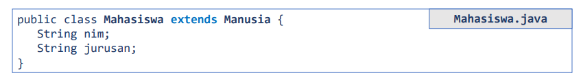
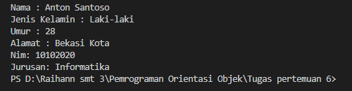
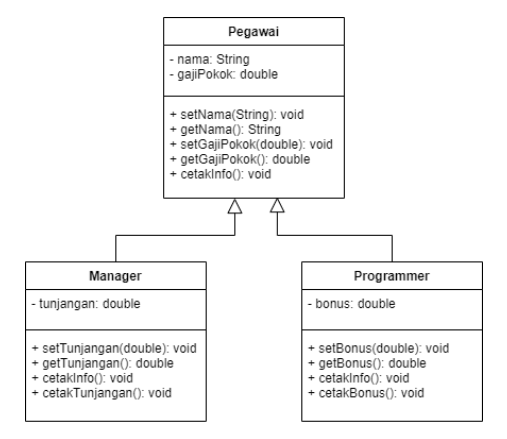
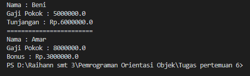

# Tugas Pertemuan 6
## Pemrograman Orientasi Objek

```sh
Nama   : Raihan Tantowi
Nim    : 312110229
Matkul : Pemrograman Orientasi Objek
```

### 1.  Lengkapi latihan class Mahasiswa dengan setter dan getter



#### A. File Manusia.java
* **Class Manusia (Super Class):**
```java
public class Manusia {
    String nama;
    String jenisKelamin;
    int umur;
    String alamat;

    public void cetakInfo() {
    System.out.println("Nama : " + this.nama);
    System.out.println("Jenis Kelamin : " + this.jenisKelamin); 
    System.out.println("Umur : " + this.umur); 
    System.out.println("Alamat : " + this.alamat);
    }
}
```

#### B. File Mahasiswa.java
* **Class Mahasiswa (Sub Class):**
```java
public class Mahasiswa extends Manusia {
    String nim;
    String jurusan;

    public void cetakInfo() {
        //memanggil method
        super.cetakInfo();
    }
    // setter
        public void setNim(String nim) {
        this.nim = nim;
        }
        public void Setjurusan(String jurusan) {
        this.jurusan = jurusan;
        }
        // getter
        public String getNim() {
        return this.nim;
        }
        public String getJurusan() {
        return this.jurusan;
        }
    }
```

#### C. File MahasiswaBeraksi.java
* **Class MahasiswaBeraksi (Main):**
```java
public class MahasiswaBeraksi {
    public static void main(String[] args){
    
    // Membuat object
    Mahasiswa anton = new Mahasiswa();

    /* memanggil atribut dan memberi nilai */
    anton.setNim("10102020");
    anton.nama = "Anton Santoso";
    anton.jenisKelamin = "Laki-laki";
    anton.umur = 28;
    anton.alamat = "Bekasi Kota";
    anton.Setjurusan("Informatika");
    anton.cetakInfo();
    System.out.println("Nim: " + anton.getNim());
    System.out.println("Jurusan: " + anton.getJurusan());
    }
} 
```

* **Hasil output program:**




### 2.   Implementasikan java code diagram class berikut:



#### A. File Pegawai.java
* **Class Pegawai (Super Class):**
```java
public class Pegawai {
    String Nama;
    double GajiPokok;

    public void setNama(String Nama){
        this.Nama = Nama;
    }
    public String getNama(){
        return this.Nama;
    }
    public void setGajiPokok(double GajiPokok){
        this.GajiPokok = GajiPokok;
    }
    public double getGajiPokok(){
        return this.GajiPokok;
    }
    public void cetakinfo(){
        System.out.println("Nama : " + this.Nama);
        System.out.println("Gaji Pokok : " + this.GajiPokok);
    }
}
```

#### B. File Manager.java
* **Class Manager (Sub Class):**
```java
public class Manager extends Pegawai{
    double Tunjangan;

    public void setTunjangan(double Tunjangan) {
        this.Tunjangan = Tunjangan;
    }
    public double getTunjangan() {
        return this.Tunjangan;
    }
    public void cetakinfo() {
        super.cetakinfo();
    }
    public void cetakTunjangan() {
         Tunjangan = 6000000;
         System.out.println("Tunjangan : Rp." + this.Tunjangan);
    }
}
```

#### C. File Programmer.java
* **Class Programmer (Sub Class):**
```java
public class Programmer extends Pegawai{
    double Bonus;

    public void setBonus(double Bonus) {
        this.Bonus = Bonus;
    }
    public double getBonus() {
        return this.Bonus;
    }
    public void cetakinfo() {
        super.cetakinfo();
    }
    public void cetakBonus() {
        Bonus = 3000000.00;
        System.out.println("Bonus : Rp." + this.Bonus);
    }
}
```

#### D. File MahasiswaBeraksi.java
* **Class MahasiswaBeraksi (Main):**
```java
public class MahasiswaBeraksi {
    public static void main(String[] args){
    
    // Membuat object
    Mahasiswa anton = new Mahasiswa();

    /* memanggil atribut dan memberi nilai */
    anton.setNim("10102020");
    anton.nama = "Anton Santoso";
    anton.jenisKelamin = "Laki-laki";
    anton.umur = 28;
    anton.alamat = "Bekasi Kota";
    anton.Setjurusan("Informatika");
    anton.cetakInfo();
    System.out.println("Nim: " + anton.getNim());
    System.out.println("Jurusan: " + anton.getJurusan());
    }
} 
```

* **Hasil output program:**


